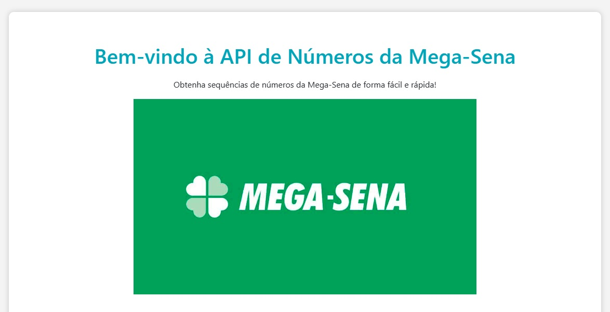

# API de Números da Mega-Sena

Esta é uma API simples que fornece uma sequência de números da Mega-Sena.

## Como Executar Localmente

Para executar esta API localmente, siga os passos abaixo:

### Pré-requisitos

Certifique-se de que você tem o Node.js instalado no seu sistema. Você pode baixá-lo em [nodejs.org](https://nodejs.org/).

### Instalação

1. Clone este repositório para o seu sistema ou faça o download do código-fonte.

2. Navegue até o diretório raiz do projeto.

3. Abra um terminal ou prompt de comando no diretório raiz e execute o seguinte comando para instalar as dependências do projeto:

       npm install

### Executando a API

Após a instalação das dependências, você pode iniciar a API com o seguinte comando:
    
    npm start

A API será executada localmente e a DOCUMENTAÇÃO estará disponível em `http://localhost:3000/`.

## Rotas

### 1. Rota para Obter uma Sequência de Números da Mega-Sena

Esta rota permite obter sequências de números da Mega-Sena com base em filtros específicos.

- **URL**: `/numeros-megassena`
- **Método**: GET
- **Descrição**: Esta rota retorna sequências de números da Mega-Sena com base em filtros específicos. Você pode utilizar o parâmetro "filtro" para especificar o tipo de sequência desejada.

#### Parâmetros

- **filtro** (opcional): Um parâmetro de consulta que especifica o filtro para a sequência desejada.
  - "pares": Retorna uma sequência contendo apenas números pares.
  - "impares": Retorna uma sequência contendo apenas números ímpares.

#### Exemplo de Requisição

1. Obtendo uma sequência completa:

    `GET /numeros-megassena`

2. Obtendo uma sequência de números pares:

   `GET /numeros-megassena?filtro=pares`

3. Obtendo uma sequência de números ímpares:

   `GET /numeros-megassena?filtro=impares`

#### Resposta de Exemplo

A resposta depende do filtro especificado:

- Sequência completa de números da Mega-Sena:

        [5, 12, 22, 30, 45, 55]

- Sequência de números pares da Mega-Sena:

        [4, 12, 22, 30, 46, 56]

- Sequência de números ímpares da Mega-Sena:

        [41, 1, 11, 13, 5, 25]

- Filtro inválido (quando o parâmetro "filtro" não é "pares" ou "impares"):

        `Filtro inválido! Tente novamente.`

#### Observações

- Esta funcionalidade permite obter sequências específicas de números da Mega-Sena com base em filtros.
- Lembre-se de utilizar o parâmetro "filtro" na consulta para especificar o tipo de sequência desejada.
- Os filtros disponíveis são "pares" e "impares."
- Esta API é uma implementação simples apenas para fins ilustrativos. A sequência de números gerada é fictícia e não tem relação com os resultados reais da Mega-Sena.

## Recursos
### Módulo Personalizado (modulos.js)
* Este servidor utiliza um módulo personalizado chamado `modulos` para gerar a sequência de números da Mega-Sena.

### Sequência de Números
* A sequência de números é gerada pelo módulo modulos.js e é composta por seis números.

## Iniciando o Servidor
* O servidor é iniciado na porta 3000.

### Exemplo de Inicialização do Servidor
http://localhost:3000/

Servidor rodando na porta 3000

## Observações
* Esta API é uma implementação simples apenas para fins ilustrativos.
* A sequência de números gerada é fictícia e não tem relação com os resultados reais da Mega-Sena.
* O módulo modulos.js deve ser personalizado para atender às necessidades reais do seu projeto.
* Lembre-se de substituir a sequência de números gerada pelo módulo modulos.js por uma implementação que atenda aos requisitos reais da sua aplicação.
