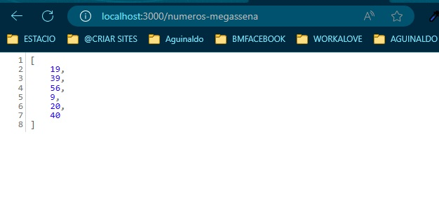
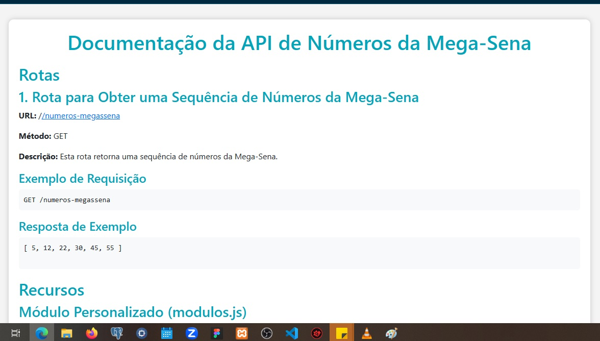

# API de Números da Mega-Sena

Esta é uma API simples que fornece uma sequência de números da Mega-Sena.

## Rotas

### 1. Rota para Obter uma Sequência de Números da Mega-Sena

- **URL:** `/numeros-megassena`
- **Método:** GET
- **Descrição:** Esta rota retorna uma sequência de números da Mega-Sena.

#### Exemplo de Requisição

`GET /numeros-megassena`

#### Resposta de Exemplo
`
[
    5, 12, 22, 30, 45, 55
]
`

## Recursos
### Módulo Personalizado (modulos.js)
* Este servidor utiliza um módulo personalizado chamado `modulos` para gerar a sequência de números da Mega-Sena.

### Sequência de Números
* A sequência de números é gerada pelo módulo modulos.js e é composta por seis números.

## Iniciando o Servidor
* O servidor é iniciado na porta 3000.

### Exemplo de Inicialização do Servidor
http://localhost:3000/

Servidor rodando na porta 3000

## Observações
* Esta API é uma implementação simples apenas para fins ilustrativos.
* A sequência de números gerada é fictícia e não tem relação com os resultados reais da Mega-Sena.
* O módulo modulos.js deve ser personalizado para atender às necessidades reais do seu projeto.
* Lembre-se de substituir a sequência de números gerada pelo módulo modulos.js por uma implementação que atenda aos requisitos reais da sua aplicação.